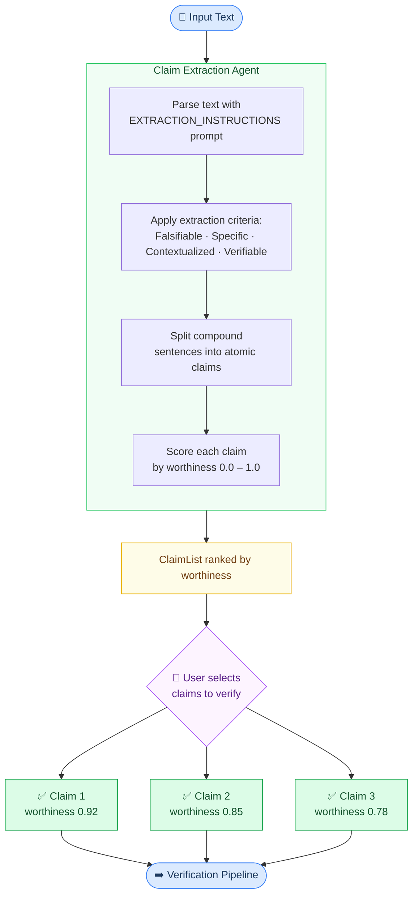
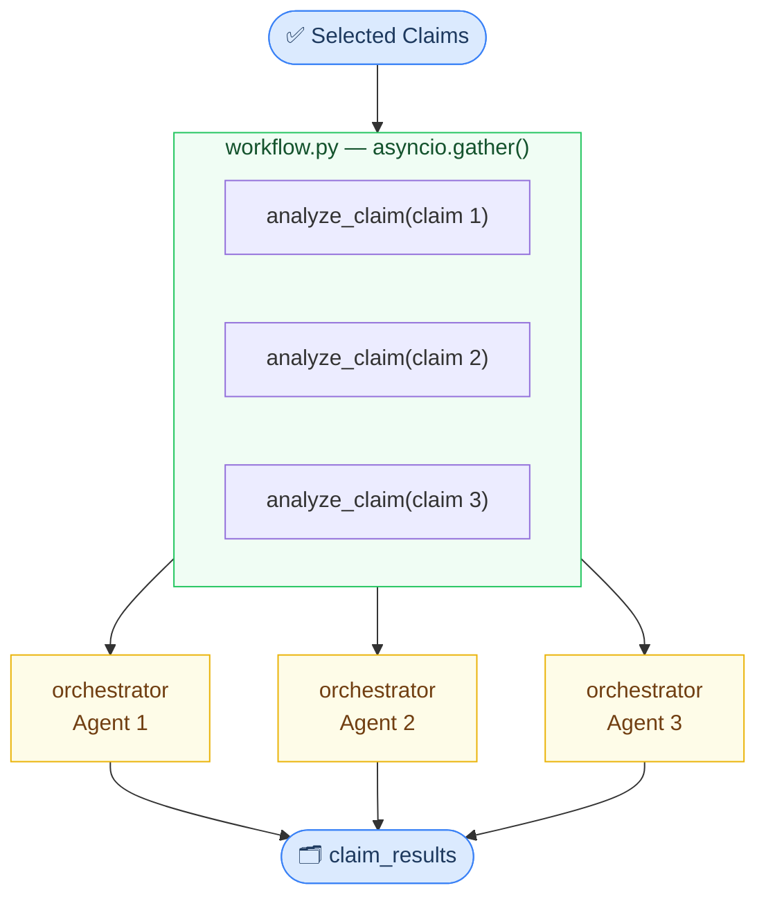
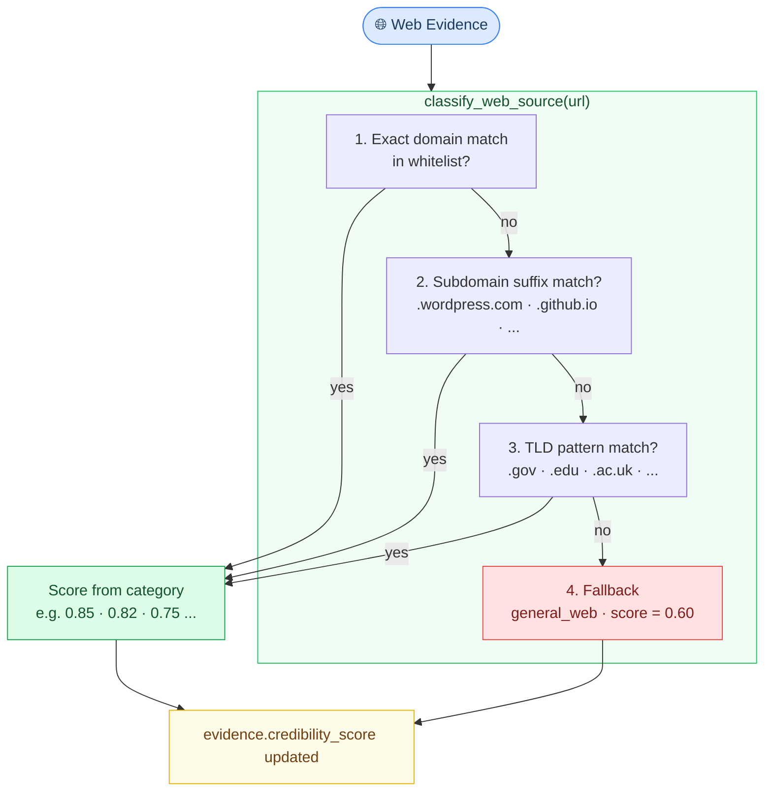
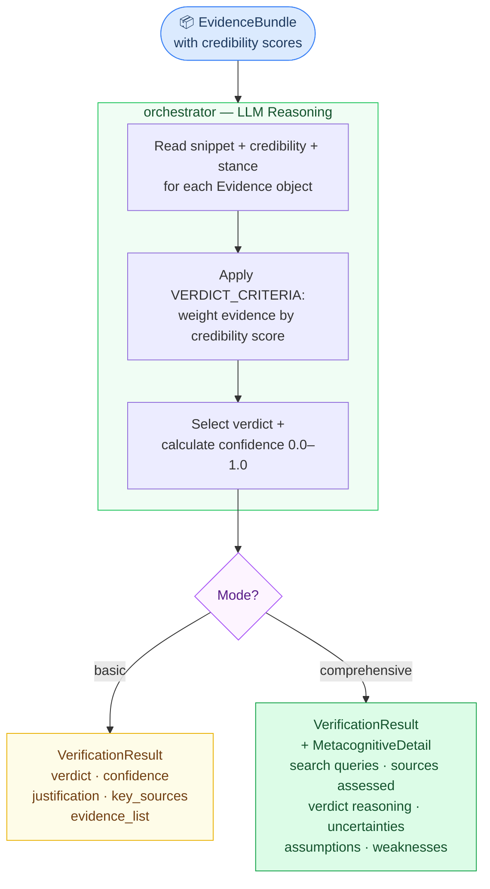

# MetaCheck: Building an Educational AI Fact-Checker for Teaching Critical Thinking

**Subtitle:** A multi-agent system that teaches learners how to verify information, not just what to believe

---

## Table of Contents

1. Introduction
2. Claim Extraction: From Text to Verifiable Statements
3. The Verification Pipeline: Multi-Agent Evidence Gathering
4. Educational Design: Learning Through Comparison

---

## 1. Introduction

_(Already written by user)_

Disinformation and fake news have become a global problem. The advancements in technology, in particular, artificial intelligence, have paved the way for creating and promoting disinformation via a myriad of ways.

Disinformation can mislead people, shape public opinion, and weaken trust in institutions, especially during important events and crises. Higher education institutions (HEIs) are especially exposed to disinformation because students rely heavily on online information for learning, research, and everyday decisions. Therefore, both students and teachers should be equipped with the capabilities of assessing information.

While AI can be used for creating and promoting disinformation, for instance, via fake images and videos, synthetic voice, and online bots, among others, it can also be used to assess information and detect disinformation.

That said, using AI for disinformation detection also requires careful design because these models can produce confident but incorrect statements. Therefore, the AI literacy for disinformation should be focused on teaching learners what AI tools can and cannot do, how to verify AI-generated answers with independent sources, and how to document and reflect on their verification steps.

In this article, we will develop an AI tool, MetaCheck, an educational fact-checking tool designed to help learners and educators evaluate information critically. Unlike commercial fact-checkers, MetaCheck's primary goal is educational transparency, demonstrating how AI systems verify claims, not just what verdict they reach.

**MetaCheck:**
- Extracts verifiable claims from text
- Searches the web, Wikipedia, and fact-check sources
- Classifies domain credibility via a configurable taxonomy
- Weighs evidence and issues structured verdicts (Refuted, Supported, Insufficient Information) with confidence scores
- Highlights full metacognitive detail for learners (search strategy, stance, uncertainties, assumptions, verdict reasoning)

The tool lets users first add their own assessment for a verification task, then use AI to perform the same verification, and compare their assessment with AI's. This way, the tool not only serves as an information checker, but also teaches learners how to assess information and how to improve their metacognitive process for information assessment.

The tool uses a multi-agentic approach to run the above-mentioned workflow. The complete workflow is shown in the figure below.

The tool extracts verifiable claims from the text and lets the user select what claims they want to verify. It then creates as many parallel agents as there are claims. Each agent runs three parallel tools: web search, Wikipedia search, and fact-check sources search. An aggregator aggregates the complete evidence and generates the final verdict.

Let's dive in.

---

## 2. Claim Extraction

Not every sentence in a text is worth verifying. MetaCheck therefore begins by identifying only the statements that are specific, falsifiable, and require consulting external sources to confirm or refute.

The user pastes any free-form text — a news article, a social media post, a research summary, or a student reading passage. Claim extraction is handled by the agent defined in `backend/app/agents.py`:

```python
# backend/app/agents.py

claim_extractor = Agent(
    name="claim_extractor",
    instructions=EXTRACTION_INSTRUCTIONS,
    model=MODEL_NAME,
    output_type=ClaimList,
)
```

The agent is driven by `EXTRACTION_INSTRUCTIONS` (`backend/app/core/constants.py`) that instructs the model to behave like a professional fact-checker. The key criteria a statement must satisfy to be extracted as a claim are:

1. **Falsifiable** — it can be proven wrong
2. **Specific** — it contains concrete details (numbers, dates, names, locations)
3. **Contextualized** — it is tied to an entity, time, or place
4. **Externally verifiable** — it requires consulting sources beyond general knowledge

The prompt also instructs the agent to split compound sentences into individual claims when each fact requires different evidence. 

The agent returns a structured `ClaimList` object (`backend/app/core/models.py`), where each item is a `Claim`:

```python
# backend/app/core/models.py

class Claim(BaseModel):
    text: str
    worthiness_score: float = Field(ge=0.0, le=1.0, default=0.8)
    extracted_at: datetime = Field(default_factory=datetime.now)
    ...
```

Each extracted claim carries a `worthiness_score` between 0.0 and 1.0, assigned by the LLM during extraction. The user then selects which claim(s) to send to the verification pipeline. 

The figure below shows the full claim extraction flow.




---

## 3. The Verification Pipeline: Multi-Agent Evidence Gathering

Once the user selects claims, MetaCheck launches a parallel verification pipeline with one independent agent per claim, each gathering evidence using three tools simultaneously and producing a structured verdict. 

### 3.1. Parallel Agent Creation

MetaCheck creates one orchestrator agent per selected claim and executes them all in parallel. Since the agents communicate no information with each other during evidence gathering, running them in parallel results in a much faster workflow.

The agent is defined once in `backend/app/core/agents.py` and executed once per claim:

```python
# backend/app/core/agents.py

orchestrator = Agent(
    name="metacognitive_orchestrator",
    model=MODEL_NAME,
    instructions=f"""Fact-check orchestrator. For each claim:
1. Use comprehensive_evidence_tool to gather ALL evidence
   (Tavily web search + Wikipedia + Google Fact Check) in parallel
2. For each Evidence object, analyze stance:
   - Web / Wikipedia: set stance based on snippet content
   - Fact check: stance set by rating interpretation
3. Apply verdict criteria:
   - SUPPORTED: Multiple credible sources (≥0.7) confirm, no contradictions
   - REFUTED: Credible sources (≥0.7) explicitly contradict
   - INSUFFICIENT_INFORMATION: <2 sources OR all <0.7 credibility
   - CONFLICTING_EVIDENCE: Credible sources disagree on both sides
4. Return VerificationResult with verdict, confidence (0–1),
   justification, key_sources, evidence_list
""",
    tools=[comprehensive_evidence_tool],
    output_type=OrchestratorOutput,
)
```

The spawning happens in `backend/app/core/workflow.py`, where a task is created for each selected claim and all tasks are handed to `asyncio.gather()`:

```python
# backend/app/core/workflow.py

semaphore = asyncio.Semaphore(int(os.getenv("METACHECK_MAX_CONCURRENCY", "5")))

async def analyze_claim(claim_text: str):
    async with semaphore:
        agent_result = await Runner.run(
            orchestrator,
            (
                f"{mode_instruction}\n"
                "Use comprehensive_evidence_tool to gather ALL evidence in one parallel call.\n"
                f"Claim to verify: {claim_text}"
            ),
            max_turns=5,
        )
        ...

# One task per claim — all run in parallel
claim_tasks = [analyze_claim_with_timeout(claim) for claim in claim_texts]
claim_results = await asyncio.gather(*claim_tasks)
```

A semaphore bounds the maximum number of concurrently running agents (default: 5, configurable via `METACHECK_MAX_CONCURRENCY`), and each agent is wrapped in a timeout of 90 seconds (`per_claim_timeout_seconds` in `backend/app/core/tool_settings.py`) to prevent runaway calls.



### 3.2. Parallel Evidence Gathering

Each orchestrator agent calls a single tool — `comprehensive_evidence_tool` (`backend/app/core/tools.py`) which internally fires three evidence sources in parallel and returns a unified `EvidenceBundle`.

```python
# backend/app/core/tools.py

@function_tool
async def comprehensive_evidence_tool(claim: str, mode: str = "basic") -> EvidenceBundle:
    # Load source limits from settings
    max_web  = mode_settings.get("max_web_sources", 3)       # basic: 3  | comprehensive: 5
    max_wiki = mode_settings.get("max_wikipedia_sources", 2) # basic: 2  | comprehensive: 3
    max_fact = mode_settings.get("max_fact_check_sources", 2)# basic: 2  | comprehensive: 3

    # Create three parallel tasks
    tavily_task = tavily_client.search_async(claim, max_results=max_web, search_depth=tavily_depth)
    wiki_task   = wikipedia_client.search_for_claim_async(claim, max_results=max_wiki)
    fact_task   = google_fact_check_client.search_fact_checks_async(claim, max_results=max_fact)

    # Execute all three in parallel
    (web_evidence, web_status), (wiki_evidence, wiki_status), (fact_evidence, fact_status) = \
        await asyncio.gather(tavily_task, wiki_task, fact_task)

    # Combine into a single list
    combined = (web_evidence or []) + (wiki_evidence or []) + (fact_evidence or [])
    return EvidenceBundle(evidence=combined, search_status=SearchStatusSummary(...))
```

**Tavily** (`TavilyClient.search_async`) queries the web and returns results ranked by a relevance score. Each result is wrapped in an `Evidence`. The credibility of web search sources (0.50-0.85) is determined from a domain taxonomy (explained later).

**Wikipedia** (`WikipediaClient.search_for_claim_async`) queries the Wikipedia REST API and fetches page summaries. Wikipedia evidence gets a fixed credibility score of 0.8, reflecting its community-edited but generally reliable nature. 

**Google Fact Check** (`GoogleFactCheckClient.search_fact_checks_async`) queries the Google Fact Check Tools API and returns verdicts from professional fact-checkers such as PolitiFact, Snopes, and FullFact. These sources receive the highest credibility score (0.95). 

All results are collected as `Evidence` objects and aggregated into a single list:

```python
# backend/app/core/models.py

class Evidence(BaseModel):
    source_name:      str
    source_type:      Literal["fact_check", "wikipedia", "web_search"]
    url:              str
    snippet:          str
    relevance_score:  float  # 0.0 – 1.0
    credibility_score: float  # 0.0 – 1.0
    stance: Optional[Literal["supports", "refutes", "neutral", "unclear"]] = None
```

The agent then reads each snippet to assign a stance (supports, refutes, neutral, unclear) for each source's evidence, before proceeding to verdict generation.


### 3.3. Domain Credibility Classification

The sources returned by Tavily web search are assigned different weights. A government health agency and a personal blog may both appear in Tavily results, but treating them as equally credible would distort the final verdict. MetaCheck therefore runs every web search result through a domain-based classification step that assigns it a score from a configurable taxonomy.

The taxonomy lives in `backend/app/config/config.json` and defines 8 credibility tiers, each with a score, a list of matching domains, subdomain suffixes, and TLD patterns:

```json
// backend/app/config/config.json (representative excerpt)

{
  "default_score": 0.6,
  "categories": {
    "government_public":    { "score": 0.85, "tld_patterns": [".gov", ".gov.uk", ...],
                              "domain_whitelist": ["who.int", "un.org", "europa.eu", ...] },
    "scientific_journals":  { "score": 0.82, "domain_whitelist": ["nature.com", "science.org", ...] },
    "academic_research":    { "score": 0.80, "tld_patterns": [".edu", ".ac.uk", ".ac.jp", ...],
                              "domain_whitelist": ["ieee.org", "researchgate.net", ...] },
    "institutional_medical":{ "score": 0.75, "domain_whitelist": ["cdc.gov", "nih.gov", "mayoclinic.org", ...] },
    "established_news":     { "score": 0.75, "domain_whitelist": ["nytimes.com", "bbc.com", "reuters.com", ...] },
    "think_tanks":          { "score": 0.72, "domain_whitelist": ["brookings.edu", "rand.org", ...] },
    "international_news":   { "score": 0.70, "domain_whitelist": ["aljazeera.com", "dw.com", ...] },
    "user_generated":       { "score": 0.50, "domain_whitelist": ["reddit.com", "medium.com", ...],
                              "subdomain_suffixes": [".github.io", ".wordpress.com", ".blogspot.com", ...] },
    "general_web":          { "score": 0.60 }  // default fallback
  }
}
```

The classification function `classify_web_source()` (`backend/app/core/domain.py`) walks through the categories in a fixed resolution order and returns on the first match. The matching hierarchy within each category is:

1. **Exact domain whitelist** — `nature.com` → `scientific_journals` (0.82)
2. **Subdomain suffix** — `myblog.wordpress.com` → `user_generated` (0.50)
3. **TLD pattern** — `health.gov.au` → `government_public` (0.85)
4. **Fallback** — no match → `general_web` (0.60)

```python
# backend/app/core/domain.py

def classify_web_source(url: str, ...) -> Dict:
    domain = parsed.netloc.lower().lstrip("www.")

    for category_key in resolution_order:
        category = categories[category_key]

        if domain in category.get("domain_whitelist", []):
            return {"credibility_score": category["score"], "category": category_key, ...}

        for suffix in category.get("subdomain_suffixes", []):
            if domain.endswith(suffix):
                return {"credibility_score": category["score"], ...}

        for tld in category.get("tld_patterns", []):
            if domain.endswith(tld):
                return {"credibility_score": category["score"], ...}

    return {"credibility_score": default_score, "category": "general_web", ...}  # 0.6
```

Classification is applied in `backend/app/core/workflow.py` after evidence gathering, writing the score on each web search `Evidence` object. Wikipedia (0.80) and fact-check sources (0.95) use fixed scores and are not passed through this step.

```python
# backend/app/core/workflow.py

for evidence in claim_result.evidence_list:
    if evidence.source_type == "web_search" and evidence.url:
        classification = classify_web_source(evidence.url)
        evidence.credibility_score = classification["credibility_score"]
```



### 3.4. Verdict Generation

With all evidence gathered and credibility scores assigned, the orchestrator agent synthesizes the `EvidenceBundle` into a structured verdict. The agent reads every evidence snippet, considers each source's credibility and stance, and applies the verdict criteria defined in `VERDICT_CRITERIA` (`backend/app/core/constants.py`).

There are four possible verdicts:

- **`SUPPORTED`** — multiple credible sources (≥ 0.7) confirm the claim with no credible contradictions
- **`REFUTED`** — credible sources (≥ 0.7) explicitly contradict the claim; a single high-credibility refutation (> 0.8) outweighs several low-credibility sources supporting it
- **`INSUFFICIENT_INFORMATION`** — fewer than 2 sources total, or all sources fall below 0.7 credibility, or evidence is too vague/outdated to decide
- **`CONFLICTING_EVIDENCE`** — multiple credible sources (≥ 0.7) disagree on both sides with no clear resolution

The confidence score (0.0–1.0) reflects how strongly the evidence supports the verdict, weighted by source credibility. The rules are explicit in the prompt:

```
Evidence Weighting Rules (VERDICT_CRITERIA in backend/app/core/constants.py):

Credibility thresholds:
  - High-credibility: > 0.8   (fact-checkers 0.95, top government/science sites 0.82-0.85)
  - Credible:        >= 0.7   (Wikipedia 0.80, established news 0.75, web sources 0.70-0.85)
  - Low-credibility:  < 0.7   (general web 0.60, user-generated 0.50)

Decision priority:
  1. Credible sources (>=0.7) dominate verdict — they outweigh any number of low-credibility sources
  2. Compare total credibility weight on each side (sum of credibility scores)
  3. Only use INSUFFICIENT_INFORMATION when no credible sources exist or all stances are unclear
```

The agent returns a `VerificationResult` (`backend/app/core/models.py`):

```python
# backend/app/core/models.py

class VerificationResult(BaseModel):
    claim:               str
    verdict:             Literal["SUPPORTED", "REFUTED", "INSUFFICIENT_INFORMATION", "CONFLICTING_EVIDENCE"]
    confidence:          float                        # 0.0 – 1.0
    justification:       str                          # 1 sentence (basic) or full reasoning (comprehensive)
    key_sources:         List[str]                    # "Source Name [URL]"
    evidence_list:       List[Evidence] = []
    metacognitive_steps: List[MetacognitiveStep] = []
    metacognitive_detail: Optional[MetacognitiveDetail] = None
```

The `metacognitive_detail` field has two modes. In **comprehensive mode**, the agent populates it with a full educational record:

```python
# backend/app/core/models.py

class MetacognitiveDetail(BaseModel):
    search_queries:         List[SearchQuery] = []   # Queries generated and why
    search_strategy_summary: str = ""
    sources_found:          int = 0
    sources_assessed:       List[SourceAssessment] = []
    sources_rejected:       List[RejectedSource] = []  # Sources found but excluded
    contradiction_detection: Optional[ContradictionDetection] = None
    verdict_reasoning:      Optional[VerdictReasoning] = None
    ai_uncertainties:       List[str] = []           # What the AI couldn't determine
    assumptions_made:       List[str] = []
    potential_weaknesses:   List[str] = []           # Where this assessment might be wrong
    metacognitive_summary:  str = ""
    total_assessment_time:  Optional[float] = None   # Seconds
```

In **basic mode**, both `metacognitive_steps` and `metacognitive_detail` are stripped from the result after verification completes, keeping the response concise:

```python
# backend/app/core/workflow.py

if selected_mode == "basic":
    for cr in claim_results:
        cr.metacognitive_steps = []
        cr.metacognitive_detail = None
```



#### 3.4.4. Metacognitive Detail (Comprehensive Mode)

---

## 4. Educational Design: Learning Through Comparison

### 4.1. Student Self-Assessment

#### 4.1.1. Assessment Interface

#### 4.1.2. Guided Assessment Framework

### 4.2. Side-by-Side Comparison

#### 4.2.1. Comparison Interface Design

#### 4.2.2. What Gets Compared

### 4.3. AI-Generated Learning Feedback

#### 4.3.1. Comparison Service Implementation

#### 4.3.2. Feedback Generation

#### 4.3.3. Constructive Improvement Suggestions

---

## Closing

If you try MetaCheck in your classroom or adapt it for your institution, I would be interested to hear about your experience. If you encounter issues or have suggestions for educational use cases, feel free to share them in the comments.

---

**GitHub Repository:** [MetaCheck - An Evidence-Based Fact Checker](https://github.com/umairalipathan1980/MetaCheck---An-Evidence-Based-Fact-Checker)
