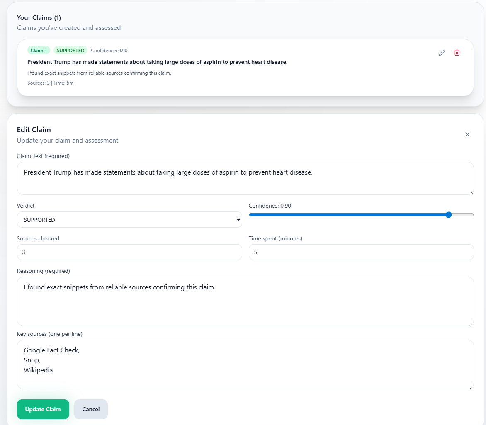
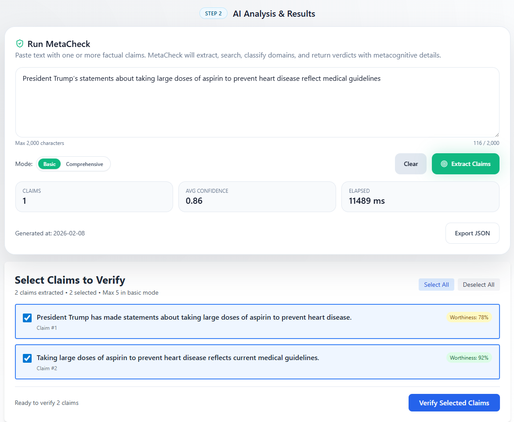
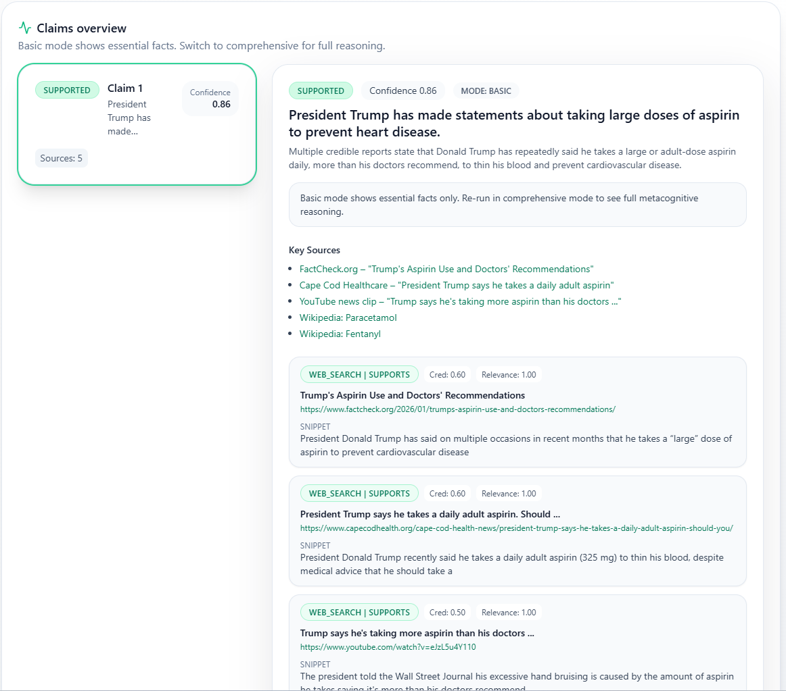
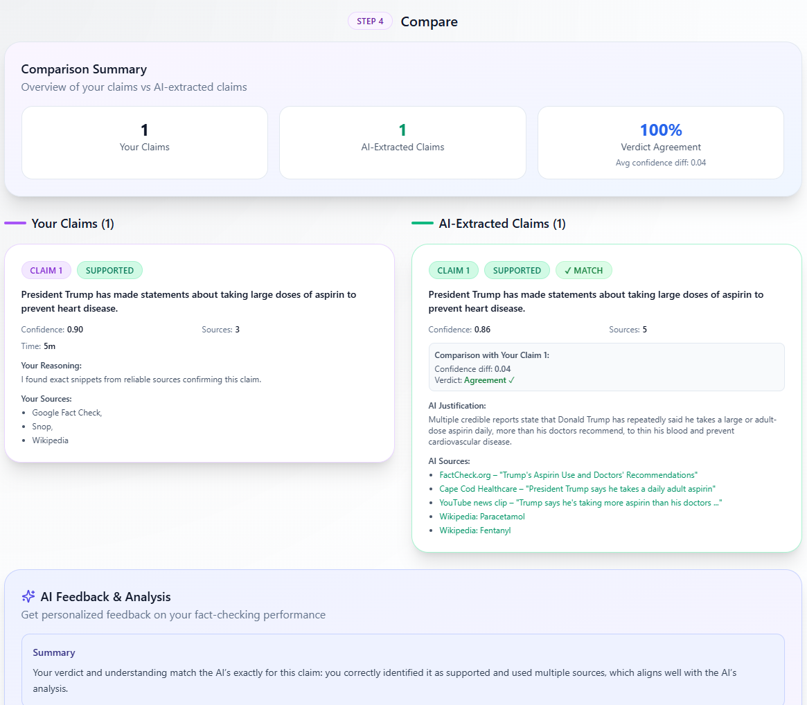

# MetaCheck

MetaCheck is an educational fact-checking tool designed to help students and educators learn how to evaluate information critically. Unlike commercial fact-checkers, MetaCheck's primary goal is educational transparency — showing students how AI systems verify claims, not just what verdict they reach.

It:
- Extracts verifiable claims from text
- Searches web, Wikipedia, and fact-check APIs for evidence
- Classifies domain credibility via a configurable taxonomy
- Weighs evidence and issues structured verdicts with confidence
- Surfaces full metacognitive detail for students (search strategy, stance, uncertainties, assumptions, verdict reasoning)

The tool lets the users first add their own assessment for a verification task, and then use AI to do the same verification, and compare their assessment with AI's assessment.

<p align="center">
  <br>
  <em>Add your own assessment for a verification task</em>
</p>

<p align="center">
  <br>
  <em>AI assessment (view 1)</em>
</p>

<p align="center">
  <br>
  <em>AI assessment (view 2)</em>
</p>

<p align="center">
  <br>
  <em>Comparison of user vs. AI assessment with feedback</em>
</p>

Stack: FastAPI backend + React/Vite frontend (Tailwind + shadcn-style components) powered by a modular core engine. Uses standard OpenAI (`OPENAI_API_KEY`) plus optional Google Fact Check and Wikipedia keys.

Verdicts: `SUPPORTED`, `REFUTED`, `INSUFFICIENT_INFORMATION`, `CONFLICTING_EVIDENCE`.

## Architecture

```
MetaCheck/
├── backend/                    # FastAPI Backend
│   ├── app/
│   │   ├── core/              # Core MetaCheck Engine (modular)
│   │   │   ├── __init__.py    # Public API: verify_claims, FinalAssessment
│   │   │   ├── MetaCheck.py   # Facade (backward compatible re-exports)
│   │   │   ├── models.py      # Pydantic data models
│   │   │   ├── constants.py   # Verdict criteria, instructions, config
│   │   │   ├── clients.py     # API clients (Google Fact Check, Wikipedia)
│   │   │   ├── analysis.py    # MetacognitiveTracker
│   │   │   ├── domain.py      # Domain classification logic
│   │   │   ├── tools.py       # Function tools for agents (parallel evidence gathering)
│   │   │   ├── agents.py      # Agent definitions (orchestrator, extractors)
│   │   │   ├── workflow.py    # Main verify_claims function (parallel agent execution)
│   │   │   └── settings.py    # Environment configuration
│   │   ├── config/
│   │   │   ├── config.json    # Domain credibility taxonomy
│   │   │   └── settings.json  # Runtime configurable settings
│   │   ├── api/
│   │   │   └── routes.py      # FastAPI endpoints
│   │   └── services/
│   │       ├── metacheck_service.py  # Service layer wrapper
│   │       └── comparison_service.py # Comparison analysis (direct LLM call)
│   ├── main.py                # FastAPI app entry point
│   └── requirements.txt
│
└── frontend/                   # React + Vite Frontend
    ├── src/
    │   ├── components/        # UI components
    │   ├── hooks/             # Custom hooks (useVerify)
    │   └── lib/               # API client, utilities
    └── package.json
```

## Agentic Workflow Overview

```
┌─────────────────────────────────────────────────────────────────┐
│                           INPUT TEXT                            │
└─────────────────────────────────────────────────────────────────┘
                                 │
                                 ▼
┌─────────────────────────────────────────────────────────────────┐
│               STEP 1: Claim Extraction Agent                    │
│               (claim_extractor)                                 │
│   • Extracts verifiable, falsifiable claims                     │
│   • Filters opinions and common knowledge                       │
│   • Splits compound claims into atomic statements               │
│   • Returns claims with worthiness scores                       │
└─────────────────────────────────────────────────────────────────┘
                                 │
                                 ▼
┌─────────────────────────────────────────────────────────────────┐
│            STEP 2: Claim Preview & Selection (UI)               │
│   • Display all extracted claims with worthiness scores         │
│   • Paginated view: 5 claims per page with prev/next buttons    │
│   • User selects which claims to verify (checkbox UI)           │
│   • Limits: 5 basic | 3 comprehensive (configurable)            │
└─────────────────────────────────────────────────────────────────┘
                                 │
                ┌────────────────┼────────────────┐
                ▼                ▼                ▼
       ┌─────────────┐  ┌─────────────┐  ┌─────────────┐
       │Verification │  │Verification │  │Verification │
       │  Agent 1    │  │  Agent 2    │  │  Agent N    │
       └─────────────┘  └─────────────┘  └─────────────┘
                │                │                │
┌───────────────┴────────────────┴────────────────┴───────────────┐
│   STEP 3: Parallel Verification (N agents run concurrently)     │
│                                                                 │
│   Each agent gathers evidence using ALL tools in PARALLEL:      │
│                                                                 │
│              ┌─────────────────┐                                │
│              │  Tavily Web     │                                │
│          ┌──▶│  Search         │──┐                             │
│          │   └─────────────────┘  │                             │
│          │                        │                             │
│          │   ┌─────────────────┐  │                             │
│  PARALLEL├──▶│  Wikipedia      │──┤                             │
│   CALL   │   │  Search         │  │                             │
│          │   └─────────────────┘  │                             │
│          │                        │                             │
│          │   ┌─────────────────┐  │                             │
│          └──▶│ Google Fact     │──┘                             │
│              │ Check API       │                                │
│              └─────────────────┘                                │
│                        │                                        │
│                        ▼                                        │
│             ┌─────────────────────┐                             │
│             │ All evidence        │                             │
│             │ gathered in parallel│                             │
│             └─────────────────────┘                             │
│                        │                                        │
│                        ▼                                        │
│             ┌─────────────────────┐                             │
│             │ Apply domain        │                             │
│             │ classification &    │                             │
│             │ VERDICT_CRITERIA    │                             │
│             └─────────────────────┘                             │
│                        │                                        │
│                        ▼                                        │
│             ┌─────────────────────┐                             │
│             │ VerificationResult  │                             │
│             └─────────────────────┘                             │
└─────────────────────────────────────────────────────────────────┘
                                 │
                                 ▼
┌─────────────────────────────────────────────────────────────────┐
│              STEP 4: Aggregate & Return Results                 │
│              • Collect all VerificationResults                  │
│              • Aggregate search statuses                        │
│              • Calculate overall confidence                     │
│              • Return FinalAssessment                           │
└─────────────────────────────────────────────────────────────────┘
```

**Key Points:**
- **Two-step workflow**: Extract → Select → Verify (user control over which claims to verify)
- **Two levels of parallelism**:
  1. **Agent-level**: N verification agents run concurrently (bounded by semaphore, default max: 5)
  2. **Tool-level**: Within each agent, Tavily + Wikipedia + Google Fact Check gather evidence in parallel
- **Each agent sees ALL evidence** before applying VERDICT_CRITERIA to make final verdict
- Verdicts: `SUPPORTED`, `REFUTED`, `INSUFFICIENT_INFORMATION`, `CONFLICTING_EVIDENCE`

## Main Components

- **Core Engine (`backend/app/core/`)**: Modular multi-agent orchestration system with dual-level parallelism
  - `models.py`: 16 Pydantic models for claims, evidence, verdicts, metacognitive detail
  - `agents.py`: Agent definitions (claim_extractor, verification orchestrator)
  - `workflow.py`: Parallel verification workflow - spawns N concurrent agents (asyncio.gather)
  - `tools.py`: Parallel evidence gathering tools (Tavily + Wikipedia + Google Fact Check run concurrently)
  - `domain.py`: Config-driven domain credibility classification
  - `analysis.py`: MetacognitiveTracker
  - `clients.py`: GoogleFactCheckClient, WikipediaClient

- **Configuration System**:
  - `backend/app/config/config.json`: Domain credibility taxonomy (0.50-0.85 range)
  - `backend/app/config/settings.json`: Runtime configurable settings (claim limits, source limits, model, timeouts, Tavily search depth)

- **Backend (`backend/`)**: FastAPI service with automatic module reload on settings changes

- **Frontend (`frontend/`)**: React UI with Settings panel, student self-assessment, AI analysis, and concise comparison feedback

## Search Status Tracking

MetaCheck now tracks the success/failure status of all evidence gathering operations. Each verification result includes a `search_status` object showing:

- **Status types**: `success`, `no_results`, `error`, `no_api_key`
- **Tracked searches**: Wikipedia, Google Fact Check, Web Search
- **Visibility**:
  - API response includes `search_status` field in `FinalAssessment`
  - Helps distinguish between "no evidence found" vs "search failed"

This transparency helps students understand when API keys are missing or searches encounter errors, improving educational value.

## Quickstart

### 1. Backend
```bash
cd backend
# Create .env (see .env.example)
# Required: OPENAI_API_KEY
# Optional: GOOGLE_FACT_CHECK_API_KEY, WIKIPEDIA_ACCESS_TOKEN

python -m venv .venv && .\.venv\Scripts\activate  # Windows
# source .venv/bin/activate  # macOS/Linux

pip install -r requirements.txt
uvicorn main:app --reload --host 0.0.0.0 --port 8000
```
Health check: `http://localhost:8000/api/health`

### 2. Frontend
```bash
cd frontend
# Create .env with VITE_API_URL=http://localhost:8000

npm install
npm run dev  # default: http://localhost:5173
```

## How to Use

MetaCheck is designed for **educational learning**, not just quick fact-checking. The most effective way to develop critical thinking skills is to follow the complete three-step learning sequence:

### Step 1: Create Your Assessment First

**Tab: "Your Assessment"**

Start here before using AI analysis:

- Read the text you want to fact-check
- Manually identify verifiable claims (statements that can be proven true or false)
- Research each claim using search engines, Wikipedia, fact-checking sites, etc.
- For each claim, create your assessment:
  - **Claim text**: The specific statement you're verifying
  - **Verdict**: Your conclusion (SUPPORTED, REFUTED, INSUFFICIENT_INFORMATION, or CONFLICTING_EVIDENCE)
  - **Confidence**: How sure are you? (0-100%)
  - **Reasoning**: Explain why you reached this verdict
  - **Sources**: List the evidence sources you consulted (with URLs)
  - **Time spent**: Track how long it took you to verify this claim

### Step 2: Run AI Analysis

**Tab: "AI Analysis"**

After completing your own assessment, let MetaCheck analyze the same text:

1. **Extract Claims** (max 2,000 characters of input text)
   - AI automatically identifies verifiable, falsifiable claims
   - Filters out opinions, common knowledge, and vague statements
   - Splits compound claims into atomic statements
   - Assigns worthiness scores to help prioritize verification

2. **Preview & Select Claims** (paginated view: 5 claims per page)
   - Review all extracted claims with their worthiness scores
   - Select which claims to verify using checkboxes
   - Limits: 5 claims in basic mode, 3 in comprehensive mode (configurable via Settings)

3. **Choose Mode**:
   - **Basic Mode (Fast and concise)**: Concise output with verdicts, confidence, and key sources
   - **Comprehensive Mode (Takes longer)**: Full metacognitive detail showing how the AI reasoned through the verification (search strategies, source assessments, uncertainties, assumptions, verdict logic)

4. **View Results**: Each verified claim shows:
   - Verdict with confidence score
   - Multiple evidence sources (Tavily web search, Wikipedia, Google Fact Check)
   - Source credibility scores with domain classification
   - Justification explaining the reasoning
   - Evidence breakdown by stance (supporting, refuting, neutral, unclear)
   - Search status tracking (which searches succeeded/failed)

**Evidence Sources**: The AI gathers information in parallel from:
- **Tavily Web Search**: Real-time web results with domain credibility classification (0.50-0.85)
- **Wikipedia**: Reliable encyclopedia content (fixed credibility: 0.8)
- **Google Fact Check**: Professional fact-checker verdicts (fixed credibility: 0.95)

### Step 3: Compare & Learn

**Tab: "Compare"**

See side-by-side differences between your assessment and the AI's analysis:

- **Visual Comparison**: Your claims vs AI claims in parallel columns
- **Match Indicators**: See where you agreed or differed with the AI
- **Detailed Differences**: Compare verdicts, confidence levels, sources used, and reasoning approaches
- **AI Feedback**: Click "Analyze My Performance" to get concise educational feedback:
  - Brief summary of how your assessment compared to the AI's
  - Specific areas for improvement (2-4 actionable suggestions)
  - Helps you identify blind spots and learning opportunities

**Why comparison matters**: This step reveals your blind spots, shows alternative research approaches, and helps you calibrate confidence. It's where you learn what you might have missed or where you excelled.

### Additional Features

- **Settings Panel**: Configure verification behavior without code changes
  - Adjust claim limits per mode (basic/comprehensive)
  - Set maximum sources per evidence type (Tavily, Wikipedia, Google Fact Check)
  - Choose AI model (GPT-5.1, GPT-4.1-mini, GPT-5-mini)
  - Set per-claim timeout and Tavily search depth (basic/advanced)
  - Changes apply immediately via automatic backend reload

- **In-App Documentation**: Complete user guide covering workflow, modes, verdicts, evidence weighting, source credibility, and educational best practices, plus full domain taxonomy reference

### Quick Option: Direct AI Analysis

If you need fast verification without the learning workflow, you can skip directly to "AI Analysis" and use it as a standalone fact-checker. However, you'll miss the educational benefits of independent critical thinking and self-assessment.

